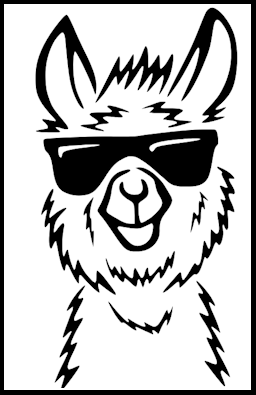

[](https://discord.gg/tPWjMwK) [](https://twitter.com/tinyBigGAMES)

# Dllama

### Overview
A simple and easy to use library for doing LLM inference directly from <a href="https://www.embarcadero.com/products/delphi" target="_blank">Delphi</a>. It can load <a href="https://huggingface.co/docs/hub/gguf" target="_blank">GGUF</a> formatted LLMs into CPU or GPU memory. Uses CUDA back end for acceleration.

### Installation
- Download <a href="https://github.com/tinyBigGAMES/Dllama/archive/refs/heads/main.zip" target="_blank">Dllama</a> and extract to a desired location. 
- Download a GGUF model from Hugging Face (only ones that are supported by <a href="https://github.com/ggerganov/llama.cpp" target="_blank">llama.cpp</a>). I've been testing using <a href="https://huggingface.co/NousResearch/Hermes-2-Pro-Mistral-7B-GGUF/resolve/main/Hermes-2-Pro-Mistral-7B.Q4_0.gguf?download=true" target="_blank">Hermes-2-Pro-Mistral-7B-GGUF</a>.
- If you have a CUDA supported GPU, it will be accelerated for faster inference, otherwise if will use the CPU. You will not be able to use a model larger than your available resources, so take note of the amount of memory that it requires. 
- See the examples in `installdir\examples` folder on how to use **Dllama** in Delphi. Be sure to update the `CModelPath` and `CModelFilename` constants used by the examples to valid values on your system.
- This project was built using Delphi 12.1 (latest), Windows 11 (latest), Intel Core i5-12400F 2500 Mhz 6 Cores, 12 logical, 36GB RAM, NVIDIA RTX 3060 GPU 12GB RAM.
- You MUST include **Dllama.dll** with your projects. It's just a dependency DLL, containing compiled 3rd party open-source C libraries used to make this project. See <a href="THIRDPARTY.md" target="_blank">THIRDPARTY.md</a> for details.
- Please test it and feel free to submit pull requests. I want to make it into something very cool for us Delphi developers.
- If this project is useful to you, consider starring the repo, sponsoring it, spreading the word, etc. Any help is greatly welcomed and appreciated.

### Examples  
A query example:
```Delphi  
uses
  System.SysUtils,
  Dllama.Utils,
  Dllama;
  
const
  // update to your model path
  CModelPath = 'C:\LLM\gguf';

  // update to your model reference name
  CModelName = 'hermes';
  
var
  LOllama: TDllama;
  LUsage: TDllama.Usage;
  LResponse: string;
  LUsage: TDllama.Usage;  
begin
  // clear console
  Console.Clear();

  // display title
  Console.PrintLn('Dllama - Query Example'+Console.CRLF, Console.MAGENTA);

  LDllama := TDllama.Create(); 

  // set model path
  LDllama.SetModelPath(CModelPath);
  
  // add models
  AddModel('Hermes-2-Pro-Mistral-7B.Q4_0.gguf', 'hermes', 1024, True);

  // try to load model
  if LDllama.LoadModel(CModelName) then
    begin
      // show loaded model filename
      Console.ClearLine(Console.WHITE);
      Console.Print('Loaded model: "%s"'+Console.CRLF+Console.CRLF, [GetModelFilename()], Console.CYAN);

      // add messages
      LDllama.AddSystemMessage('You are a helpful AI assistant.');
      LDllama.AddUserMessage('How to make KNO3?');

      // display user message
      Console.Print(LDllama.GetUserMessage(), Console.DARKGREEN);

      // do inference
      if LDllama.Inference(LResponse, @LUsage) then
      begin
        // display usage
        Console.PrintLn();
        Console.PrintLn();
        Console.PrintLn('Tokens :: Input: %d, Output: %d, Total: %d', 
          [LUsage.InputTokens, LUsage.OutputTokens, LUsage.TotalTokens], Console.BRIGHTYELLOW);
        Console.PrintLn('Speed  :: Input: %3.2f t/s, Output: %3.2f t/s', 
          [LUsage.TokenInputSpeed, LUsage.TokenOutputSpeed], Console.BRIGHTYELLOW);
      end;
      // unload model
      LDllama.UnloadModel();
    end
  else
    // failed to load model
    Console.Print(Console.CRLF+'failed to load model!', Console.RED)
    
  LDllama.Free();   
end.
```
### Media


https://github.com/tinyBigGAMES/Dllama/assets/69952438/9f1fc3be-01cb-45e3-8b57-25416d7e0b8d


### Support
Our development motto: 
- We will not release products that are buggy, incomplete, adding new features over not fixing underlying issues.
- We will strive to fix issues found with our products in a timely manner.
- We will maintain an attitude of quality over quantity for our products.
- We will establish a great rapport with users/customers, with communication, transparency and respect, always encouragingng feedback to help shape the direction of our products.
- We will be decent, fair, remain humble and committed to the craft.

### Links
- <a href="https://github.com/tinyBigGAMES/Dllama/issues" target="_blank">Issues</a>
- <a href="https://github.com/tinyBigGAMES/Dllama/discussions" target="_blank">Discussions</a>
- <a href="https://discord.gg/tPWjMwK" target="_blank">Discord</a>
- <a href="https://youtube.com/tinyBigGAMES" target="_blank">YouTube</a>
- <a href="https://twitter.com/tinyBigGAMES" target="_blank">X (Twitter)</a>
- <a href="https://learndelphi.org/" target="_blank">learndelphi.org</a>
- <a href="https://tinybiggames.com/" target="_blank">tinyBigGAMES</a>

<p align="center">
  
  <br>
  Proud to be an <strong>Embarcadero Technical Partner</strong>.
</p>
<sub>As an Embarcadero Technical Partner, I'm committed to providing high-quality Delphi components and tools that enhance developer productivity and harness the power of Embarcadero's developer tools.</sub>

